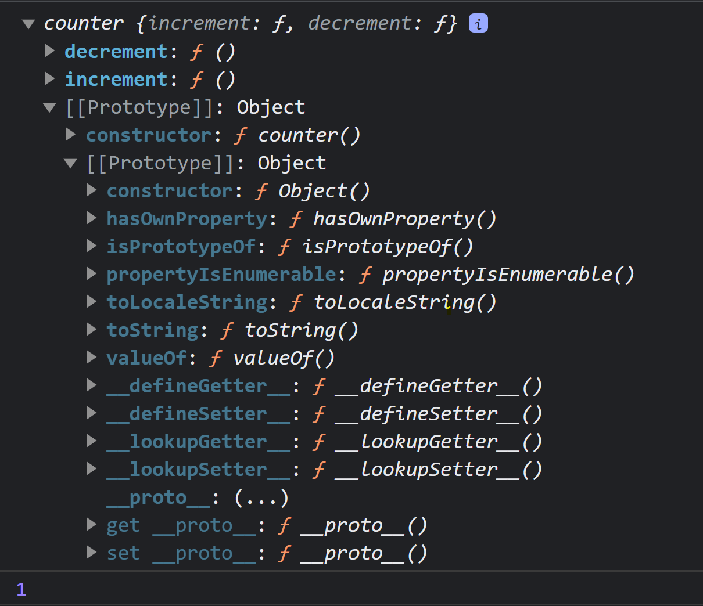
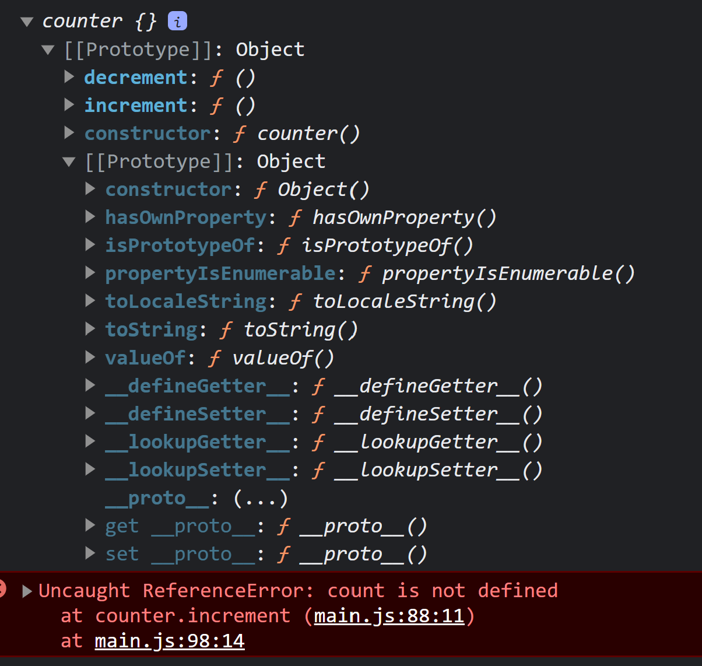

# Closure

It is an amazing feature in javascript that allows a function to remember the reference of its parent function lexical environment though the parent function's execution is completed.

#### Example:

```javascript
function outer(val) {
  function middle() {
    function inner() {
      console.log("Inner called and val = ", val);
    }
    return inner;
  }
  return middle();
}
outer(12)();
```

#### Important Questions:

```javascript
// print 1,2,3,4,5 in the console without using let in for loop
for (var i = 1; i <= 5; i++) {
  setTimeout(() => {
    console.log(i);
  }, 1000 * i);
}
// First Approach: Using closure
for (var i = 1; i <= 5; i++) {
  function call(i) {
    setTimeout(() => {
      console.log(i);
    }, 1000 * i);
  }
  call(i);
}
// Second Approach: Using Function as a object property
for (var i = 1; i <= 5; i++) {
  function call() {
    console.log(call.i);
  }
  call.i = i;
  setTimeout(call, 1000 * i);
}
```

### Advantages of Closure:

1. Function currying
2. Memorization
3. Data Hiding & Encapsulation

#### Data Hiding using closure

```javascript
// Can't access the count value directly, but through the returned function which are
// firstCounter and secondCounter in the case below.
// Each time counter is invoked a new closure is also formed
function counter() {
  let count = 0;
  return function () {
    console.log(count);
    return count++;
  };
}
const firstCounter = counter();
firstCounter();
firstCounter();
const secondCounter = counter();
secondCounter();
secondCounter();
secondCounter();
```

#### Can we also add decrement?

```javascript
// We can return an object instead of only one function
function counter() {
  let count = 0;
  return {
    value() {
      console.log(count);
      return count;
    },
    increment() {
      console.log(++count);
      return count;
    },
    decrement() {
      console.log(--count);
      return count;
    },
  };
}
const firstCounter = counter();
firstCounter.increment();
firstCounter.increment();
firstCounter.increment();
firstCounter.decrement();
firstCounter.decrement();
firstCounter.value();
```

#### Is the code above scalable?

```javascript
// The code above is not scalable, in that case we should use constructor function
function counter() {
  let count = 0; // As count is not attached to this it will be private
  this.increment = function () {
    console.log(++count);
    return count;
  };
  this.decrement = function () {
    console.log(--count);
    return count;
  };
}
const firstCounter = new counter();
console.log(firstCounter);
firstCounter.increment();

// CAN NOT USE THE BELOW CODE FOR THIS
// Reason - Prototype can't access the count variable declared inside counter()
function counter() {
  let count = 0;
  this.decrement = function () {
    console.log(--count);
    return count;
  };
}
counter.prototype.increment = function () {
  console.log(++count);
  return count;
};
counter.prototype.decrement = function () {
  console.log(++count);
  return count;
};
const firstCounter = new counter();
console.log(firstCounter);
firstCounter.increment();
```

### Difference between the two above code

<section style="display: flex; gap:2rem; justify-content: space-between;">
    <div>1. Method Inside Constructor Function, Output in Browser Console:
        </div>
    <div>2. Method As Prototype, Output in Browser Console:
        </div>
</section>

In the above pictures, for the first one decrement & increment method is inside the constructor object. But for the second one decrement & increment method is inside the constructor function.

## Disadvantages of Closure:

1. Memory Leaking
2. Over usage of memory
3. Takes more space in memory
4. Stay in the memory till the programme is not completely finished and no garbage collected.

## Smart Garbage Collection

```javascript
// when lol is invoked, there will be x present in the closure. You
// can see it in chrome developer tools but y will not be there as
// the memory is freed by smart garbage cllector of JS Engine as
// it no longer required in the code
function a(params) {
  let x = 123,
    y = 123140000;
  return function b(params) {
    console.log(x);
  };
}
let lol = a();
lol();
```
